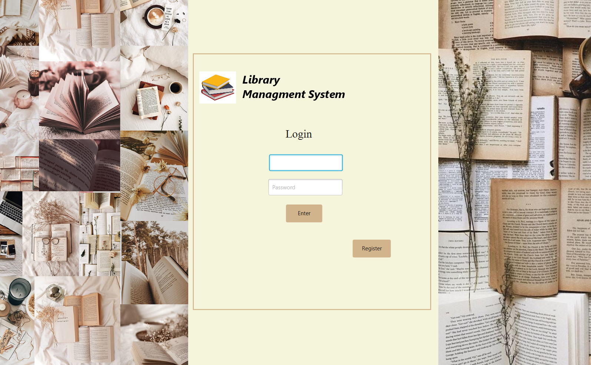
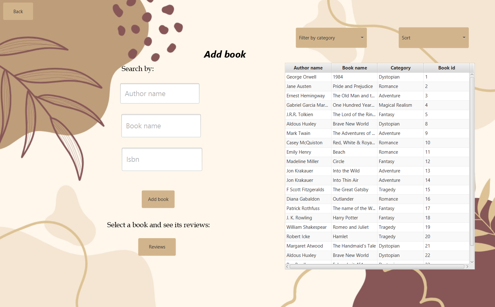

# Library Management System

## Overview

Welcome to the Library Management System! This application allows users to create accounts, borrow books, review them, and return them. The system is connected to a database that stores user credentials, current book borrowings, and returned books information.

## Functionality

1. **Login/Register:**
   
   - Upon running the application, users are presented with a login page.
   - Existing users can log in using their username and password.
   - New users can navigate to the registration page to provide personal information and complete the registration process.

3. **Dashboard:**
   
   - After logging in, users are directed to their dashboard with three main options:
   - Add New Books
   - See Your Books
   - Go to Your Account Page
        
5. **Add New Books:**
   
   - Users can search and add books from the existing database.
   - Search options include title, author, category, and ISBN.
   - Books can be sorted alphabetically by title.
   - Users can view reviews from other users for the selected books.

7. **See Your Books:**
   - Users can view a list of borrowed books.
   - Reviews can be submitted for each book.
   - A "Return" button is available to return borrowed books.

8. **Your Account Page:**
   - Users can view their personal information entered during registration.
   - Passwords can be changed, and accounts can be deleted.

9. **Admin Page:**
   - Admins can access a page listing all books in the database.
     
## Future Development

1. **Enhancements to Admin Page:**
   - Display books associated with each user.
   - Implement features to manage user-specific book data.
